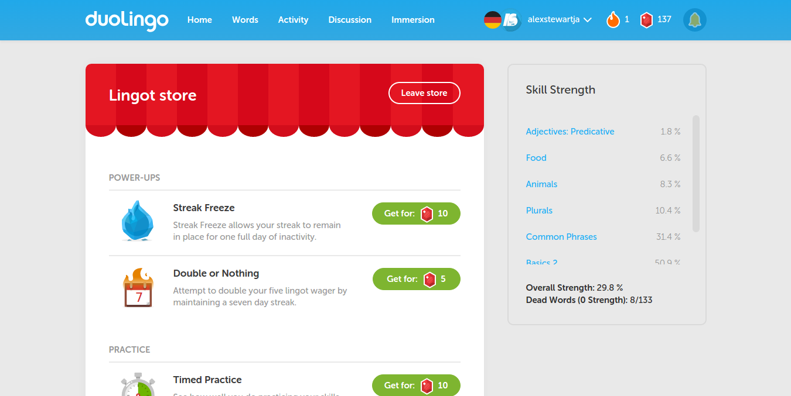
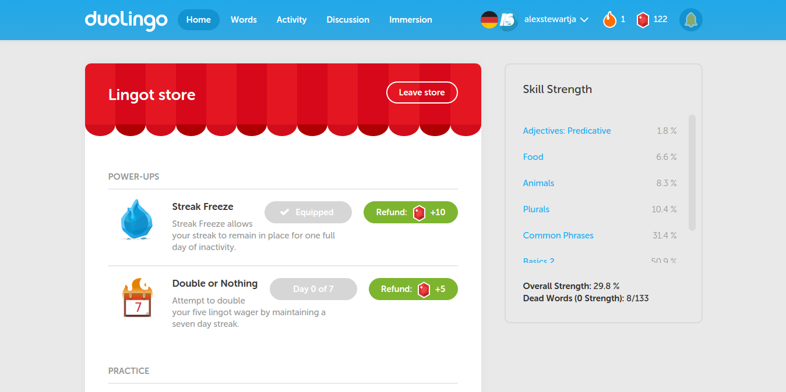
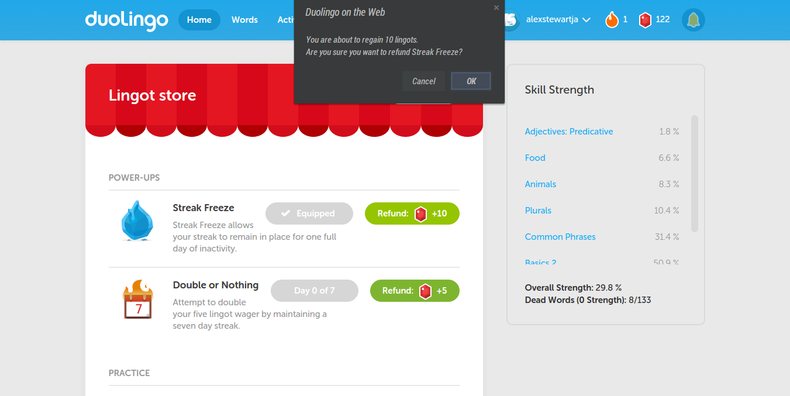
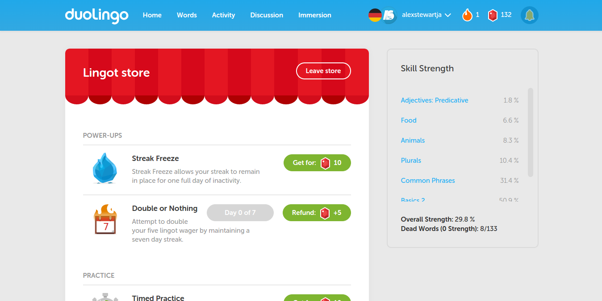

# Duolingo Refund Store Items
Userscript for [Duolingo](https://www.duolingo.com) that allows users to cancel store item purchases and regain spent lingots.

### How To Install

1. Install the respective extension for your browser (may require browser restart):
 * Firefox: [Greasemonkey](https://addons.mozilla.org/en-US/firefox/addon/greasemonkey/)
 * Chrome/Chromium: [Tampermonkey](https://chrome.google.com/webstore/detail/tampermonkey/dhdgffkkebhmkfjojejmpbldmpobfkfo?hl=en)
 * Safari: [JavaScript Blocker](http://javascript-blocker.toggleable.com/)
 * Internet Explorer: Haha!
2. Get the userscript [here](https://raw.githubusercontent.com/alexstewartja/DuolingoRefundStoreItems/master/duolingo-refund-store-items.user.js?duo).
3. When prompted, confirm installation.

<b>Please note that [cookies](http://en.wikipedia.org/wiki/HTTP_cookie) are uitlized for the script to function as expected. Clearing browser data may affect experience.</b>

### Usage

- To use the script, navigate to Duolingo's [Lingot store](https://www.duolingo.com/show_store)
- The only store items that are refundable are <b>Streak Freeze</b>, <b>Double or Nothing</b> and <b>Timed Practice</b>.
- Once you purchase one of the above items, a <b>Refund</b> button will appear next to it, allowing you the convenience of regaining the lingots spent on that purchase.

### How To Uninstall
Follow the uninstall steps for the browser/extension you're using:
- Chrome/Chromium: [Tampermonkey](http://tampermonkey.net/faq.php?ext=dhdg#Q100)
- Firefox: [Greasemonkey](http://wiki.greasespot.net/Greasemonkey_Manual:Script_Management)
- Safari: [JavaScript Blocker](http://javascript-blocker.toggleable.com/)

### In Action

- Normal view of Lingot store:

  
- View of Lingot store after item purchases:

  
- Requesting a refund:

  
- Refund successful!:

### Future Plans
- Add a <b>Refund All</b> button to the store to avoid requesting refunds one at a time.
- Include other refundable items that have been excluded from the Duolingo UI (examples enclude <b>Heart Refill</b>, <b>Formal Attire</b> and <b>Champagne Tracksuit</b>.

### Questions/Comments?
- Join the disussion [here](http://blog.alexstew.com/original/scripts/userscripts/duolingo-refund-store-items)

